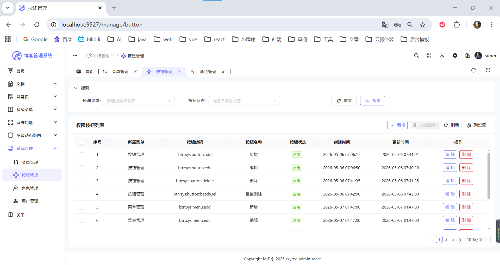
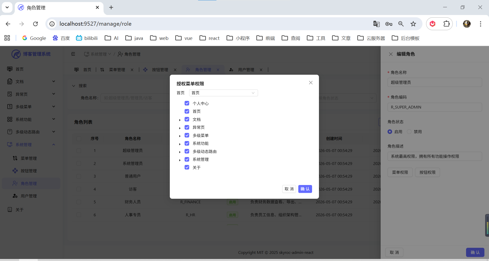

<p align="center">
  <h2 align="center">✨ 一个基于 React19 + Vite6 + TypeScript + Ant Design + UnoCSS 的清新优雅的中后台管理系统 ✨</h2>
</p>

---

## 📖 项目介绍

🎉 `skyroc-admin-react` 是一个开箱即用的中后台管理系统解决方案，基于 React 19 + Vite 6 + TypeScript 构建。集成 Ant Design 5 UI 组件库和 UnoCSS 原子化 CSS 引擎，采用 pnpm monorepo 架构管理，提供完善的权限管理、主题定制、国际化支持等企业级功能。🔗 在线预览：[skyroc](https://pzhdv.cn/skyroc)

### 核心优势

🎯 **与时俱进** — 采用 2025 年最新前端技术栈，紧跟技术潮流

💪 **功能强大** — 集成 TanStack Query、Redux Toolkit 等业界最佳实践

✨ **架构优雅** — 清晰的分层架构、模块化设计、完善的类型系统

📐 **规范性强** — 严格的代码规范、统一的项目结构，适合团队协作

---

## 🔗 配套项目

| 项目 | 描述 | 地址 |
|-----|------|------|
| 🛠️ **skyroc-admin-api** | Spring Boot + MyBatis-Plus 后端 API 服务 | [GitHub](https://github.com/pzhdv/skyroc-admin-api) |

---

## 🛠 技术栈

🚀 **React 19** — 最新的 React 版本，享受最前沿的特性

⚡ **Vite 6** — 极速的开发构建工具

🎯 **TypeScript 5.7** — 完善的类型系统

📦 **Redux Toolkit** — 现代化的状态管理方案

🔄 **TanStack Query 5** — 强大的服务端状态管理方案

🎨 **Ant Design 5.24** — 企业级 UI 组件库

🌈 **UnoCSS** — 高性能的原子化 CSS 引擎

🛤️ **React Router V7** — 强大的路由管理系统

📦 **pnpm monorepo** — 高效的包管理方案

🌍 **i18next** — 国际化框架

🎭 **Motion** — 流畅的动画系统

📊 **ECharts** — 数据可视化图表库

---

## 📦 Monorepo 架构

项目采用 pnpm workspace 管理，包含以下子包：

📡 **@sa/axios** — 封装的 HTTP 请求库，支持拦截器、错误处理等

🎨 **@sa/color** — 主题颜色处理工具库

🪝 **@sa/hooks** — 常用 React Hooks 集合（useBoolean、useArray 等）

🧩 **@sa/materials** — 通用组件库（AdminLayout、PageTab、SimpleScrollbar 等）

🛠️ **@sa/scripts** — 命令行工具集（代码生成、Git 工具、发布工具等）

🔧 **@sa/utils** — 通用工具函数库

🎯 **@sa/uno-preset** — UnoCSS 自定义预设配置

---

## ✨ 项目特点

💡 **代码质量** — 代码规范严谨，架构清晰优雅，完善的 TypeScript 类型支持

⚡ **开箱即用** — 无需复杂配置，快速启动项目开发

📋 **约定式路由** — 自动化的文件路由系统，类似 Next.js 的开发体验

🏗️ **分层架构** — 分层清晰的 Service 层架构，URL、Keys、Hooks 分离

🔐 **权限管理** — 基于角色的权限控制系统（RBAC）

🎨 **主题系统** — 支持暗黑模式、多主题色、布局配置等

🌍 **国际化** — 完整的 i18n 方案，支持多语言切换

⚙️ **Keep-Alive** — 页面缓存功能，提升用户体验

🎭 **动画效果** — 基于 Motion 的流畅动画系统

📱 **响应式设计** — 完美适配移动端和桌面端

🔧 **CLI 工具** — 内置命令行工具（Git 提交规范、代码清理等）

---

## 📸 项目功能部分截图

### 1. 登录页面


### 2. 首页


### 3. 主题配置


### 4. 中英文切换（国际化）


### 5. 菜单添加


### 6. 菜单管理


### 7. 按钮管理


### 8. 角色管理


### 9. 角色管理 - 按钮授权


### 10. 角色管理 - 菜单授权


### 11. 用户管理


---

## 📁 项目结构

```
skyroc-admin-react/
├── packages/                      # 内部包 (Monorepo)
│   ├── axios/                      # @sa/axios - HTTP 请求封装
│   ├── color/                      # @sa/color - 主题颜色处理
│   ├── hooks/                      # @sa/hooks - React Hooks 集合
│   ├── materials/                  # @sa/materials - 通用物料组件
│   ├── ofetch/                     # Fetch 封装
│   ├── scripts/                    # @sa/scripts - 命令行工具
│   ├── uno-preset/                 # @sa/uno-preset - UnoCSS 预设
│   └── utils/                      # @sa/utils - 通用工具函数
├── src/
│   ├── components/                 # 公共组件
│   │   ├── AuthBtn.tsx             # 权限按钮组件
│   │   ├── ErrorBoundary.tsx       # 错误边界
│   │   ├── SvgIcon.tsx             # SVG 图标组件
│   │   └── UploadImage/            # 图片上传组件
│   ├── config.ts                   # 全局配置
│   ├── constants/                  # 常量定义
│   ├── features/                   # 功能模块
│   │   ├── auth/                  # 认证模块
│   │   ├── menu/                  # 菜单模块
│   │   ├── router/                # 路由模块
│   │   ├── tab/                   # 标签栏模块
│   │   └── theme/                 # 主题模块
│   ├── hooks/                      # 业务 Hooks
│   ├── layouts/                    # 布局组件
│   ├── locales/                    # 国际化语言包
│   ├── pages/                      # 页面
│   ├── router/                     # 路由配置
│   ├── service/                    # 服务层 (API)
│   ├── store/                      # Redux Store
│   ├── styles/                    # 全局样式
│   ├── types/                      # TypeScript 类型
│   └── utils/                      # 工具函数
├── build/                          # 构建配置
├── public/                         # 静态资源
├── vite.config.ts                  # Vite 配置
├── uno.config.ts                   # UnoCSS 配置
├── tsconfig.json                   # TypeScript 配置
└── pnpm-workspace.yaml             # pnpm 工作区配置
```

---

## 📄 内置页面

### 🏠 首页 / 仪表盘

📊 数据卡片展示 (访问量、订单、利润等)

📈 折线图、饼图数据可视化

📋 项目动态信息流

🎠 创意轮播横幅

### ⚙️ 系统管理

| 📄 页面 | 📝 功能说明 |
|--------|------------|
| 👤 用户管理 | 用户列表、新增/编辑用户、批量删除 |
| 👥 角色管理 | 角色列表、权限分配、按钮级别权限配置 |
| 📑 菜单管理 | 菜单树形结构、拖拽排序、图标选择 |
| 🔘 按钮管理 | 按钮权限码管理、关联页面配置 |

### 🧪 功能演示

🏷️ **多标签页** — 标签栏功能演示，支持增删改刷新

🔄 **权限切换** — 动态切换用户角色，实时生效

👻 **隐藏子菜单** — 菜单配置隐藏子菜单项

🔍 **全局搜索** — 快捷键唤起，搜索页面/菜单

### 🔐 登录模块

🔑 密码登录 (支持记住密码)

📱 验证码登录

📝 用户注册

🔏 找回密码

⏰ 登录过期自动跳转

---

## 🔧 环境变量

项目根目录下的 `.env` 文件配置：

```bash
# 基础路径
VITE_BASE_URL=/

# 首页路由
VITE_ROUTE_HOME=/home

# API 基础地址
VITE_API_URL=http://localhost:8080

# 是否开启 HTTP 代理
VITE_HTTP_PROXY=Y

# 图标本地前缀
VITE_ICON_LOCAL_PREFIX=local
```

---

## 🚀 安装 & 启动

### 📋 环境要求

- 🟢 **Node.js**: >= 18.12.0
- 📦 **pnpm**: >= 8.7.0

### 📥 安装依赖

```bash
# 使用 pnpm 安装（推荐）
pnpm install
```

### 💻 开发环境

```bash
# 启动开发服务（测试环境）
pnpm dev

# 启动开发服务（生产环境）
pnpm dev:prod
```

> ⚡ 开发服务默认运行在 `http://localhost:9527`，浏览器自动打开。

### 📦 生产构建

```bash
# 打包生产环境
pnpm build

# 打包测试环境
pnpm build:test
```

### 👀 预览构建结果

```bash
# 本地预览打包结果（默认端口 9725）
pnpm preview
```

---

## 🛠 其他指令

| ⌨️ 命令 | 📝 说明 |
|--------|--------|
| `pnpm lint` | ESLint 代码检查并自动修复 |
| `pnpm typecheck` | TypeScript 类型检查 |
| `pnpm gen-route` | 自动生成路由配置 |
| `pnpm cleanup` | 清理缓存、dist、日志文件 |
| `pnpm commit` | 中文规范 Git 提交 |
| `pnpm commit:en` | 英文规范 Git 提交 |
| `pnpm release` | 一键发版、自动打标签 |
| `pnpm update-pkg` | 一键更新所有依赖包版本 |

---

## 📜 License

本项目基于 [MIT](https://github.com/pzhdv/skyroc-admin-react/blob/master/LICENSE) 协议开源，您可以自由使用、修改和分发。

---

## 👨‍💻 作者

🧩 姓名：潘宗晖（PanZonghui）

🌐 博客: [https://pzhdv.cn](https://pzhdv.cn/)

📧 邮箱: [1939673715@qq.com](mailto:1939673715@qq.com)

🐙 GitHub: [https://github.com/pzhdv](https://github.com/pzhdv)

---

## 🙏 致谢

感谢以下开源项目的贡献：

💖 [skyroc-admin](https://github.com/ohh-889/skyroc-admin) — 项目基础框架

🦆 [Ant Design](https://ant.design/) — 蚂蚁金服 UI 组件库

⚡ [Vite](https://vitejs.dev/) — 下一代前端构建工具

⚛️ [React](https://react.dev/) — 用于构建用户界面的 JavaScript 库

📘 [TypeScript](https://www.typescriptlang.org/) — JavaScript 的超集

🛠️ [Redux Toolkit](https://redux-toolkit.js.org/) — Redux 标准工具集

🔄 [TanStack Query](https://tanstack.com/query) — 强大的异步状态管理

---

如果这个项目对你有帮助，请给个 ⭐ Star 支持一下！
